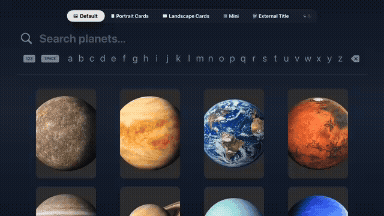

# expo-tvos-search demo

<div align="center">

[](https://www.npmjs.com/package/expo-tvos-search)
[](https://www.npmjs.com/package/expo-tvos-search)
[](https://github.com/keiver/expo-tvos-search)
[](https://github.com/keiver/expo-tvos-search/blob/main/LICENSE)



</div>

A working demo app showcasing the [expo-tvos-search](https://github.com/keiver/expo-tvos-search) library on tvOS using Expo.

## What This Demo Shows

- Native tvOS search UI using SwiftUI `.searchable` modifier
- Customizable grid layouts (columns, card dimensions, spacing)
- Multiple card styles (portrait, landscape, mini, with/without overlays)
- Marquee text scrolling for long titles
- Loading states and empty/no results screens
- Selection handling and search callbacks
- Apple TV hardware keyboard support via focus callbacks (v1.3.2+)

## Tabs

- **Minimal** - Bare minimum setup
- **Default** - 4-column grid with custom colors
- **Portrait** - Tall cards with overlay titles
- **Landscape** - Wide 16:9 cards
- **Mini** - 5-column compact layout
- **External** - Titles below cards instead of overlay
- **Help** - About this demo

See code examples below for each configuration.

## Prerequisites

- macOS with Xcode installed
- Node.js 20+

## Setup & Running

Open two terminals:

**Terminal 1** - Install, prebuild, start Metro:
```bash
npm run clear
```

**Terminal 2** - Launch tvOS simulator:
```bash
npm run tvos
```

## Using the Demo

Type planet names (`mars`, `earth`) or descriptions (`giant`, `ice`, `windy`). Use tvOS remote to navigate results, press center to select.

**Tip:** Check the "Minimal" tab for simplest setup.

## Code Examples

### Minimal - Simplest Setup
```tsx
<TvosSearchView
  results={results}
  topInset={insets.top + 80}
  onSearch={handleSearch}
  onSelectItem={handleSelect}
  style={{ flex: 1 }}
/>
```

### Default - 4-Column Grid
```tsx
<TvosSearchView
  results={results}
  columns={4}
  placeholder="Search planets..."
  isLoading={isLoading}
  topInset={insets.top + 80}
  onSearch={handleSearch}
  onSelectItem={handleSelect}
  emptyStateText="Search for planets"
  searchingText="Searching..."
  noResultsText="No planets found"
  noResultsHintText="Try a different search term"
  textColor="#e8e8e8"
  accentColor="#666666"
  cardWidth={300}
  cardHeight={450}
  showTitleOverlay={false}
  style={{ flex: 1 }}
/>
```

### Portrait - Tall Cards with Overlay
```tsx
<TvosSearchView
  results={results}
  columns={4}
  placeholder="Search planets..."
  isLoading={isLoading}
  topInset={insets.top + 80}
  onSearch={handleSearch}
  onSelectItem={handleSelect}
  emptyStateText="Search for planets"
  searchingText="Searching..."
  noResultsText="No planets found"
  noResultsHintText="Try a different search term"
  textColor="#E5E5E5"
  accentColor="#E50914"
  cardWidth={280}
  cardHeight={420}
  overlayTitleSize={18}
  style={{ flex: 1 }}
/>
```

### Landscape - Wide 16:9 Cards
```tsx
<TvosSearchView
  results={results}
  columns={3}
  placeholder="Search planets..."
  isLoading={isLoading}
  topInset={insets.top + 80}
  onSearch={handleSearch}
  onSelectItem={handleSelect}
  emptyStateText="Search for planets"
  searchingText="Searching..."
  noResultsText="No planets found"
  noResultsHintText="Try a different search term"
  textColor="#00ffff"
  accentColor="#ff00ff"
  cardWidth={500}
  cardHeight={280}
  style={{ flex: 1 }}
/>
```

### Mini - Compact 5-Column
```tsx
<TvosSearchView
  results={results}
  columns={5}
  placeholder="Search planets..."
  isLoading={isLoading}
  topInset={insets.top + 80}
  onSearch={handleSearch}
  onSelectItem={handleSelect}
  emptyStateText="Search for planets"
  searchingText="Searching..."
  noResultsText="No planets found"
  noResultsHintText="Try a different search term"
  textColor="#ffd4a3"
  accentColor="#ff6b35"
  cardWidth={240}
  cardHeight={360}
  style={{ flex: 1 }}
/>
```

### External - Titles Below Cards
```tsx
<TvosSearchView
  results={results}
  columns={4}
  placeholder="Search planets..."
  isLoading={isLoading}
  topInset={insets.top + 80}
  onSearch={handleSearch}
  onSelectItem={handleSelect}
  emptyStateText="Search for planets"
  searchingText="Searching..."
  noResultsText="No planets found"
  noResultsHintText="Try a different search term"
  textColor="#b8d4e8"
  accentColor="#FF0400"
  cardWidth={320}
  cardHeight={480}
  showTitle={true}
  showSubtitle={true}
  showTitleOverlay={false}
  cardPadding={25}
  cardMargin={40}
  style={{ flex: 1 }}
/>
```

## Structure

- `app/(tabs)/` - 7 demo tabs showing different configurations
- `constants/planets.ts` - Sample data (8 planets)

## Troubleshooting

### Issues with native module or prebuild
```bash
npm run clear
npm run tvos
```

### Search UI doesn't appear
Run on Apple TV simulator, not iPhone/iPad.

## Learn More

- [expo-tvos-search on GitHub](https://github.com/keiver/expo-tvos-search)
- [expo-tvos-search on npm](https://www.npmjs.com/package/expo-tvos-search)
- [React Native tvOS](https://github.com/react-native-tvos/react-native-tvos)
- [Expo Prebuild](https://docs.expo.dev/workflow/prebuild/)

## License

MIT
